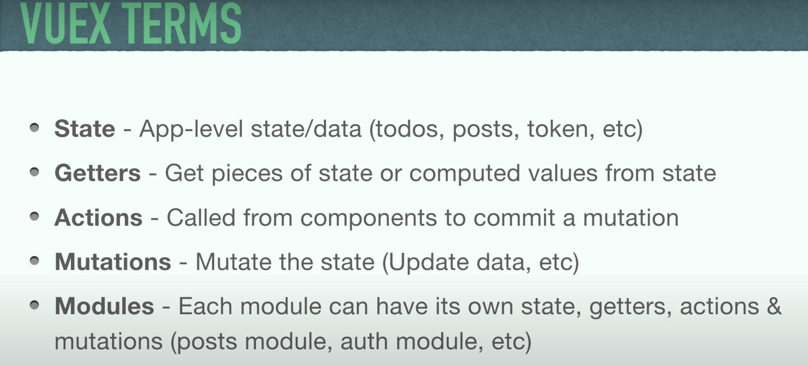

# vue-learn

## Project setup
```
yarn install
```

### Compiles and hot-reloads for development
```
yarn serve
```

### Compiles and minifies for production
```
yarn build
```

### Lints and fixes files
```
yarn lint
```

### Customize configuration
See [Configuration Reference](https://cli.vuejs.org/config/).

### 视屏教程地址
- https://www.youtube.com/watch?v=5lVQgZzLMHc&t=106s
### API测试接口
- https://jsonplaceholder.typicode.com/todos

### Vuex的基础概念

